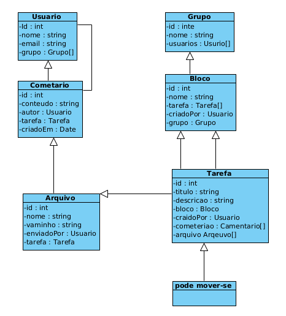
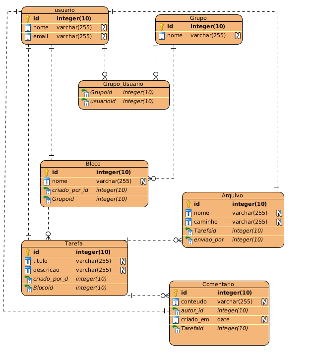

# Task-Task
# Sistema de Gerenciamento de Tarefas

## Descrição

Este sistema é uma aplicação para gerenciamento colaborativo de tarefas, onde usuários podem organizar seu trabalho em blocos de tarefas, participar de grupos, adicionar comentários e anexar arquivos às tarefas. O objetivo é facilitar a organização, acompanhamento e colaboração entre usuários para aumentar a produtividade.

---

## Diagramas

### Diagrama de Classe



### Diagrama de Banco de Dados



---

## Principais Entidades

### Usuário
Representa uma pessoa que utiliza o sistema. Cada usuário pode criar blocos, tarefas e participar de grupos. Pode também adicionar comentários e anexar arquivos.

### Bloco
É uma categoria ou agrupamento de tarefas. Um bloco pode conter múltiplas tarefas e pertence a um único usuário ou a um grupo. As tarefas podem ser movidas entre blocos a qualquer momento.

### Tarefa
Representa uma atividade que deve ser realizada. Cada tarefa pertence a um bloco específico e pode ser atribuída a um usuário ou grupo. As tarefas têm status e podem receber comentários e arquivos anexados.

### Grupo
Conjunto de usuários que colaboram em blocos e tarefas comuns. Facilita o trabalho em equipe, permitindo que múltiplos usuários tenham acesso e controlem as mesmas tarefas e blocos.

### Arquivo
Arquivos que podem ser anexados a tarefas ou comentários, facilitando o compartilhamento de documentos, imagens, e outros materiais relacionados à atividade.

### Comentário
Mensagens adicionadas às tarefas para comunicação entre usuários. Comentários podem conter texto e arquivos anexos, promovendo o diálogo e o registro das decisões e atualizações.

---

## Funcionalidades Principais

- Criação, edição e exclusão de usuários, grupos, blocos e tarefas.
- Associação de tarefas a blocos, usuários ou grupos.
- Movimentação de tarefas entre blocos.
- Upload e vinculação de arquivos às tarefas e comentários.
- Adição de comentários em tarefas para facilitar a comunicação.
- Controle de permissões via associação a grupos ou usuários.

---

## Tecnologias

- Backend: Java Spring Boot 
- Frontend: React / Next.js
- Banco de Dados: PostgreSQL 

---

## Estrutura de Classes (Resumo)

```plaintext
Usuário
 ├── Pode criar e gerenciar Blocos
 ├── Pode criar e gerenciar Tarefas
 ├── Pode participar de Grupos
 ├── Pode adicionar Comentários
 └── Pode anexar Arquivos

Bloco
 ├── Contém múltiplas Tarefas
 ├── Associado a um Usuário ou Grupo
 └── Tarefas podem ser movidas entre Blocos

Tarefa
 ├── Pertence a um Bloco
 ├── Pode ser atribuída a Usuário ou Grupo
 ├── Recebe Comentários
 └── Pode ter Arquivos anexados

Grupo
 ├── Contém múltiplos Usuários
 └── Gerencia acesso a Blocos e Tarefas

Arquivo
 ├── Anexado a Tarefas ou Comentários
 └── Suporta diversos formatos (PDF, imagens, documentos)

Comentário
 ├── Texto e arquivos anexados
 └── Relacionado a uma Tarefa

